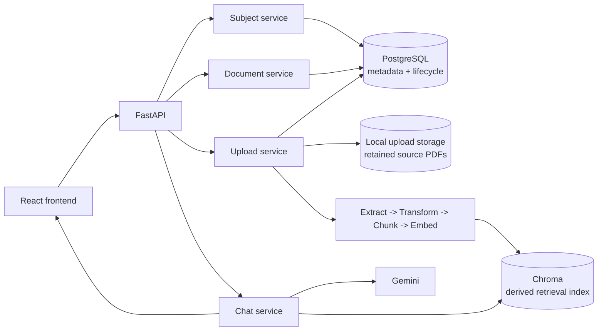

# CloudMentor AI

[](https://github.com/tonthatgiahuy16/CloudMentor-AI/actions/workflows/tests.yml)

> A document-data platform for subject-scoped RAG, built around traceable ingestion, PostgreSQL lifecycle management, and a Chroma vector index designed to be rebuildable.

CloudMentor AI is a final-year Data Science project that explores how learning documents can be converted into structured, traceable data for retrieval and LLM-based applications.

Data Engineering is the backbone of the project. The main concerns are ingestion, metadata propagation, lifecycle state, data ownership, retrieval boundaries, validation, and recovery. RAG and the frontend consume the data produced by that backbone.

## Current milestone

CloudMentor AI currently implements the components required for a local vertical slice:

```text
create subject
    -> upload PDF
    -> extract, clean, chunk, embed, and index
    -> track document lifecycle in PostgreSQL
    -> ask a subject-scoped question
    -> return an answer constrained by retrieved context
    -> show document and page references
    -> delete the document from active retrieval
```

The individual components and selected integrations have been tested locally. The complete sequence above has not yet been captured as one reproducible end-to-end test on the current commit, so the project does not claim production readiness.

## What this project demonstrates

- A modular **Extract -> Transform -> Chunk -> Embed -> Index** pipeline.
- Page-, document-, chunk-, and subject-level metadata propagated through ingestion and retrieval.
- PostgreSQL lifecycle records linked to Chroma entries through `document_id`.
- Subject-scoped retrieval to keep queries inside the selected knowledge domain.
- Context-constrained LLM answers with document and page references.
- Clear boundaries between API, services, repositories, pipeline stages, retrieval, and generation.
- Dependency injection that allows API and orchestration tests to run without live external services.
- Automated backend and frontend checks in GitHub Actions.

## Technology stack

| Layer | Technology | Role |
| --- | --- | --- |
| API | FastAPI | Upload, document, subject, and chat endpoints |
| Relational storage | PostgreSQL + SQLAlchemy | Document metadata and lifecycle state |
| PDF extraction | PyMuPDF | Page-level text extraction |
| Embeddings | BGE-M3 | Document and query vector generation |
| Vector index | Chroma | Similarity search over derived chunk embeddings |
| Generation | Gemini | Answer generation from retrieved context |
| Frontend | React + TypeScript + Vite | Document library, upload, subject management, and chat |
| Quality checks | Pytest, ESLint, TypeScript, GitHub Actions | Regression and build validation |

## Data flow

```text
PDF upload
    -> validate extension, MIME type, signature, filename, and size
    -> retain the accepted PDF in local upload storage
    -> create PostgreSQL document record as UPLOADED
    -> mark PROCESSING
    -> extract text by page
    -> normalize text
    -> create overlapping chunks with lineage metadata
    -> generate embeddings
    -> write derived vectors and metadata to Chroma
    -> mark INDEXED

Pipeline failure
    -> record FAILED status, failure stage, and error details

Question + optional subject_id
    -> embed question
    -> retrieve matching chunks, filtered by subject when selected
    -> generate an answer constrained by retrieved context
    -> return answer plus document and page references
```

## Architecture



The local upload directory currently retains successfully ingested PDFs, but it is not yet a durable production storage contract.

## Data ownership and recovery boundary

| Data | Current owner | Recovery meaning |
| --- | --- | --- |
| Subject, document metadata, and lifecycle state | PostgreSQL | System of record for operational state |
| Accepted source PDF | Local upload storage | Retained locally after successful ingestion; not yet durable storage |
| Chunk embeddings and retrieval metadata | Chroma | Derived index used for retrieval |
| Generated answer | API response | Not currently treated as a durable record |

PostgreSQL is the system of record for document metadata and lifecycle state. Chroma is a derived retrieval index. Automated index rebuilding is not yet implemented and remains part of the recovery roadmap.

A reliable rebuild also requires a durable canonical content source. The project must eventually formalize one of these approaches:

1. Store original PDFs in durable object storage, with URI and checksum recorded in PostgreSQL.
2. Store canonical extracted content or chunks in PostgreSQL or object storage.

Until one of those contracts and an automated rebuild workflow are implemented, Chroma is only **designed to be rebuildable**; it is not yet operationally rebuildable.

## Document lifecycle

```text
UPLOADED -> PROCESSING -> INDEXED
                      \-> FAILED
```

- `UPLOADED`: the file passed API validation and a document record was created.
- `PROCESSING`: extraction, transformation, embedding, or indexing is running.
- `INDEXED`: vector entries were written successfully.
- `FAILED`: the failed stage and error details were recorded for diagnosis.

Deletion removes the document from the active application view and retrieval path. Cross-store reconciliation and automated recovery remain roadmap items.

## Traceability

The ingestion path carries metadata needed to trace a retrieval result back to the source material:

- `document_id`
- `subject_id`
- `source`
- `page`
- `chunk_index`
- vector distance

The chat API returns document and page references alongside the answer. These references improve inspectability, but they do not by themselves prove answer grounding. Retrieval quality, citation correctness, and answer faithfulness still require a benchmark and evaluation dataset.

## API surface

| Method | Path | Purpose |
| --- | --- | --- |
| `GET` | `/` | API root message |
| `GET` | `/subjects/` | List subjects |
| `POST` | `/subjects/` | Create a subject |
| `POST` | `/upload/` | Validate and ingest a PDF |
| `GET` | `/documents/` | List active documents |
| `GET` | `/documents/{document_id}` | Read document metadata |
| `DELETE` | `/documents/{document_id}` | Remove a document from active use |
| `POST` | `/chat/` | Ask a question and receive answer plus sources |

`GET /` is an API root message, not a health check. Dedicated health and readiness endpoints have not yet been implemented.

Interactive API documentation is available at `http://127.0.0.1:8000/docs` while the backend is running.

## Frontend capabilities

- List documents and their processing status.
- Upload a PDF for a selected subject and chapter.
- Create a new subject from the document workspace.
- Delete a document.
- Select a subject before asking a question.
- Render the answer and its document/page references.

## Verification status

The current application baseline, capability matrix, CI evidence, verified boundaries, and remaining limitations are recorded in [`docs/PROJECT_STATUS.md`](docs/PROJECT_STATUS.md).

The long-term approved design is documented in [`docs/TARGET_ARCHITECTURE.md`](docs/TARGET_ARCHITECTURE.md).

## Repository structure

```text
CloudMentor-AI/
|-- .github/
|   `-- workflows/       # backend and frontend CI checks
|-- alembic/             # database migrations
|-- app/
|   |-- api/             # FastAPI routes
|   |-- core/            # configuration and database setup
|   |-- db_models/       # SQLAlchemy persistence models
|   |-- llm/             # prompt and model integration
|   |-- pipeline/        # extraction, transformation, and indexing stages
|   |-- rag/             # loader, chunker, embedder, retriever, vector store
|   |-- repos/           # persistence access
|   |-- schemas/         # API request and response models
|   `-- services/        # application orchestration
|-- docs/
|   |-- PROJECT_STATUS.md
|   `-- TARGET_ARCHITECTURE.md
|-- frontend/            # React + TypeScript client
|-- scripts/             # controlled maintenance and migration scripts
|-- storage/             # generated local runtime storage; Git-ignored
|-- tests/               # backend unit and API tests
|-- alembic.ini
|-- pyproject.toml
|-- requirements.txt
|-- requirements-test.txt
`-- README.md
```

## Local development

### Prerequisites

- Python 3.11
- Node.js and npm
- PostgreSQL
- A Gemini API key

### Backend

```powershell
cd CloudMentor-AI
python -m venv .venv
.\.venv\Scripts\Activate.ps1
python -m pip install -r requirements.txt
Copy-Item .env.example .env
```

Set the required values in `.env`, then start the API:

```powershell
python -m uvicorn app.main:app --reload
```

Do not commit `.env`, API keys, passwords, or connection strings.

### Frontend

```powershell
cd frontend
npm ci
npm run dev
```

The local frontend expects the API at `http://127.0.0.1:8000` unless a Vite environment override is configured.

### Windows application-control note

On a Windows machine where Application Control blocks binary Python extensions, the PostgreSQL driver may need its pure-Python implementation and the PostgreSQL client libraries on `PATH`:

```powershell
$env:Path = "C:\Program Files\PostgreSQL\18\bin;$env:Path"
$env:PSYCOPG_IMPL = "python"
```

Adjust the PostgreSQL version in the path for the local installation. This is a machine-specific workaround, not an application configuration requirement.

## Tests and checks

Run backend tests from the repository root:

```powershell
python -m pytest -q -p no:cacheprovider --basetemp .codex_pytest_tmp
Remove-Item .codex_pytest_tmp -Recurse -Force
```

Run frontend checks from `frontend/`:

```powershell
npm run lint
npm run build
```

Check staged or unstaged whitespace errors before committing:

```powershell
git diff --check
git diff --cached --check
```

## Legacy subject metadata migration

The repository includes a controlled script for backfilling missing `subject_id` metadata in legacy Chroma chunks. Migration evidence is recorded in [`docs/PROJECT_STATUS.md`](docs/PROJECT_STATUS.md).

The script contains project-specific mappings. Review the mapping, back up the Chroma data, and run a dry run before applying it to another environment.

## Current limitations

- Source PDFs are retained on local disk rather than durable object storage.
- Automated Chroma rebuild and PostgreSQL-Chroma reconciliation are not implemented.
- Ingestion is not yet fully idempotent across retries and partial failures.
- Retrieval quality and answer faithfulness have not been benchmarked.
- Integration tests do not yet cover live PostgreSQL, Chroma, embedding, and Gemini boundaries as one workflow.
- Authentication, authorization, rate limiting, observability, and production deployment are not implemented.
- Dedicated health and readiness checks are not implemented.

## Engineering principles

- PostgreSQL owns metadata and lifecycle state.
- Chroma is a derived retrieval index, not the source of truth.
- Every chunk should preserve lineage back to its subject, document, page, and chunk position.
- Pipeline stages should be independently testable and observable.
- Recovery claims must be backed by durable source data and a tested procedure.
- New infrastructure should be introduced only when the workload justifies it.

## Author

**Ton That Gia Huy**

Final-year Data Science student focused on Data Engineering and applied AI systems.

- GitHub: [tonthatgiahuy16](https://github.com/tonthatgiahuy16)
- LinkedIn: [ton-that-gia-huy](https://www.linkedin.com/in/ton-that-gia-huy)
