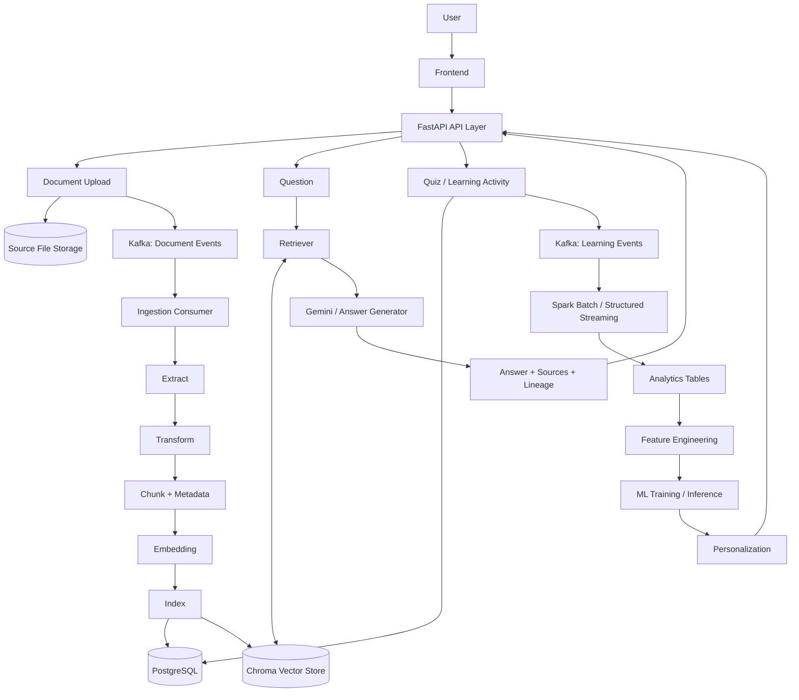

# CloudMentor AI


> **CloudMentor AI** is an AI Learning Data Platform that uses **Data Engineering as its backbone** to transform documents and learning behavior into knowledge, analytics, and personalized learning.

> [!IMPORTANT]
> This repository currently documents the **final target architecture**. Badges marked `planned` or `target capability` do not mean those components have already been implemented.

## 1. Project Overview

CloudMentor AI is designed as an end-to-end learning data platform, not merely a PDF chatbot.

The platform will:

- Ingest and manage learning documents from multiple formats.
- Build a searchable knowledge base for source-grounded RAG.
- Generate and record Quiz interactions and learning history.
- Process document events and learning events at scale.
- Produce analytical datasets and Machine Learning features.
- Detect weak topics and recommend the next learning activity.

Overall value flow:

```text
Documents -> Data Platform -> Knowledge -> RAG / Quiz
          -> Learning Events -> Analytics -> Machine Learning
          -> Personalized Learning
```

### Project status

| Area | Status |
|---|---|
| Product vision and target architecture | Documented |
| Data Engineering implementation | To be updated from source repository |
| RAG implementation | To be updated from source repository |
| Kafka and Spark | Planned phases |
| Analytics and Machine Learning | Planned phases |

## 2. Architecture Diagram



### Main data flows

**Document ingestion**

```text
Upload -> Store source file -> Publish document event
       -> Extract -> Transform -> Chunk -> Embed -> Index
       -> PostgreSQL registry/lifecycle + Chroma vector index
```

**RAG serving**

```text
Question -> Query embedding -> Retriever + metadata filters
         -> Relevant chunks -> Gemini
         -> Answer + source + page + document_id + chunk_id
```

**Learning analytics and personalization**

```text
Quiz / User Activity -> PostgreSQL + Kafka
                     -> Spark Batch / Streaming
                     -> Analytics -> Features -> ML
                     -> Recommendation
```

The following capabilities apply across all flows:

- Data Quality
- Observability
- Data Lineage
- Identity and metadata propagation
- Lifecycle and failure management

## 3. Business Value

### Problem

Learning materials are often fragmented across files and platforms. Traditional document search does not explain concepts well, while a standalone RAG chatbot cannot determine whether a learner is improving or which topic should be studied next.

### Solution

CloudMentor AI combines two data domains:

1. **Knowledge data:** subjects, documents, chapters, topics, chunks, and embeddings.
2. **Learning data:** quizzes, questions, answers, attempts, scores, and user activity.

This combination allows the platform to provide:

- Source-grounded answers that users can verify.
- Structured practice through Quiz activities.
- Learning progress and weak-topic analytics.
- Recommendations based on historical learning behavior.

### Expected outcome

When the complete roadmap is delivered, the system should be able to produce guidance such as:

> You are currently weak in **Chapter 4 — Cloud Security**. Your three latest answers about **IAM** were incorrect. Review **Identity and Access Management**, then continue with the recommended basic Quiz.

The project creates value by turning raw learning content and user activity into measurable learning decisions—not by adding tools for their own sake.

## 4. Engineering Challenges & Solutions

> [!NOTE]
> At the current architecture stage, these are **design challenges and planned responses**. This section will later be replaced with problems actually encountered, evidence, and measured results from the implementation.

| Engineering challenge | Planned solution | How it will be validated |
|---|---|---|
| Large document binaries should not travel through Kafka | Store the source file separately; publish `document_id`, `source_uri`, metadata, and processing context | Event payload inspection and upload/load testing |
| PostgreSQL lifecycle and Chroma index may become inconsistent | Treat PostgreSQL as the system of record; make Chroma a rebuildable derived index | Failure injection, reconciliation, delete, and rebuild tests |
| Replayed events may create duplicate business effects | Use stable `event_id`, idempotent consumers, retry policy, and dead-letter handling | Replay the same event and verify one business outcome |
| Metadata may be lost between pipeline stages | Define stage contracts and propagate `document_id`, `chunk_id`, subject, page, and source | Contract and lineage tests across the complete pipeline |
| RAG answers may lack reliable evidence | Apply subject filters, retrieval thresholds, grounded prompting, and source serialization | Curated retrieval/answer evaluation set |
| Machine Learning may be introduced before enough quality data exists | Build Quiz history, analytics, and versioned features before model training | Data readiness checks and baseline comparison |
| Failures may be difficult to diagnose | Add lifecycle state, structured logs, metrics, correlation IDs, and alerts | Operational dashboards and failure-recovery exercises |

Actual implementation notes should eventually follow this format:

```text
Problem -> Root cause -> Design decision -> Trade-off
        -> Implementation -> Measured result -> Remaining limitation
```

## 5. Tech Stack Rationale

| Technology | Primary role | Why it fits | Boundary / trade-off | Status |
|---|---|---|---|---|
| **Python** | Pipeline and application language | Strong ecosystem for Data Engineering, RAG, and ML | Performance-critical workloads may need distributed or compiled components | Target stack |
| **FastAPI** | Backend API layer | Typed contracts, validation, and async-friendly APIs | API should remain thin; long processing belongs in workers | Target stack |
| **PostgreSQL** | Relational system of record | Transactions, constraints, joins, and canonical lifecycle state | Not the primary semantic vector-serving layer | Target stack |
| **Chroma** | Vector serving index | Simple embedding storage, similarity search, and metadata filtering | Derived index; not the source of truth for business data | Target stack |
| **Kafka** | Event transport and streaming backbone | Decoupling, buffering, replay, partitioning, and consumer scaling | Adds operational complexity; only justified by real async/scale requirements | Planned |
| **Spark** | Distributed batch/stream processing | Large-scale joins, aggregation, Structured Streaming, and feature engineering | Unnecessary overhead for small single-node workloads | Planned |
| **Gemini** | Grounded answer generation | Generates natural-language answers from retrieved context | Does not own knowledge, lifecycle, or canonical data | Target capability |
| **Embedding model** | Semantic representation | Enables document/query similarity search | Requires evaluation and version tracking | Target capability |
| **Docker Compose** | Reproducible local environment | Simplifies multi-service development and onboarding | Compose configuration must reflect actual implemented services | Planned |

### Core architecture decisions

- **PostgreSQL is the system of record; Chroma is a rebuildable serving index.**
- **Kafka transports events; it does not replace transactional storage.**
- **Spark processes data; it does not serve application requests.**
- **Gemini generates answers; retrieved context supplies the knowledge.**
- **RAG, Quiz, Analytics, and ML are consumers of the same data platform.**
- **Kafka, Spark, and ML are added only when latency, volume, complexity, or product value justifies them.**

## 6. Setup Instructions

### Current documentation phase

This repository does not yet define a verified executable environment. At this stage, use the HTTPS or SSH URL from GitHub's **Code** menu to clone the repository, then review it as an architecture-first project. There is no application startup command yet.

Available project documents:

- [Final Target Architecture](outputs/CloudMentor_AI_Final_Target_Architecture.docx)
- [Project Goals & Final Outcomes](outputs/CloudMentor_AI_Project_Goals_and_Final_Outcomes.docx)

### Planned implementation phases

- [ ] Phase 1 — Core Data Foundation and RAG
- [ ] Phase 2 — PostgreSQL System of Record, Reliability, and Multi-source Ingestion
- [ ] Phase 3 — Quiz and Learning Application
- [ ] Phase 4 — Event-driven Processing with Kafka
- [ ] Phase 5 — Distributed Analytics with Spark
- [ ] Phase 6 — Machine Learning and Personalization

### Future local setup

Once the application source and service definitions are committed, this section will be replaced with verified instructions covering:

1. Required versions and prerequisites.
2. Environment variable configuration.
3. Database and vector-store initialization.
4. Docker Compose startup.
5. Migrations and seed data.
6. Health checks and automated tests.
7. Sample document ingestion and RAG request.

Commands such as `docker compose up` should only be added after the corresponding Compose file has been committed and tested.

---

**CloudMentor AI is built to demonstrate an end-to-end data platform—not another isolated RAG chatbot. Data Engineering is the backbone; RAG, Quiz, Analytics, and Machine Learning are its consumers.**
